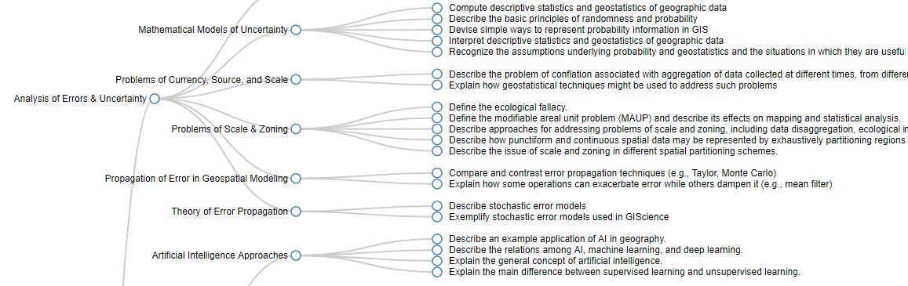
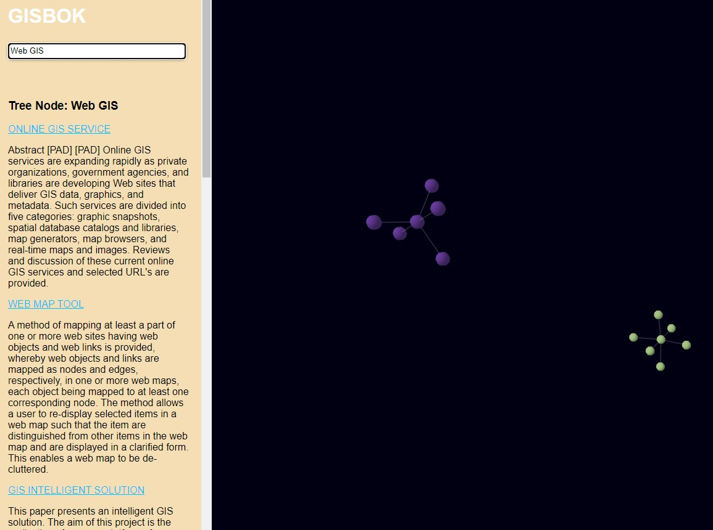
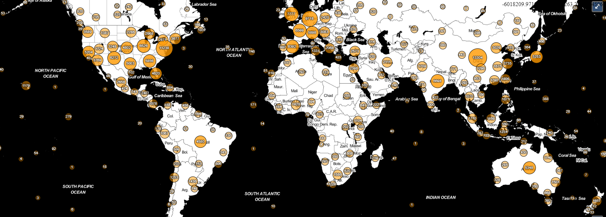
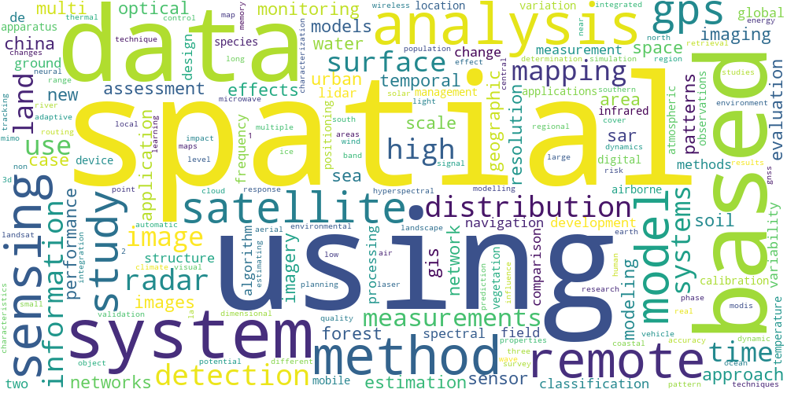
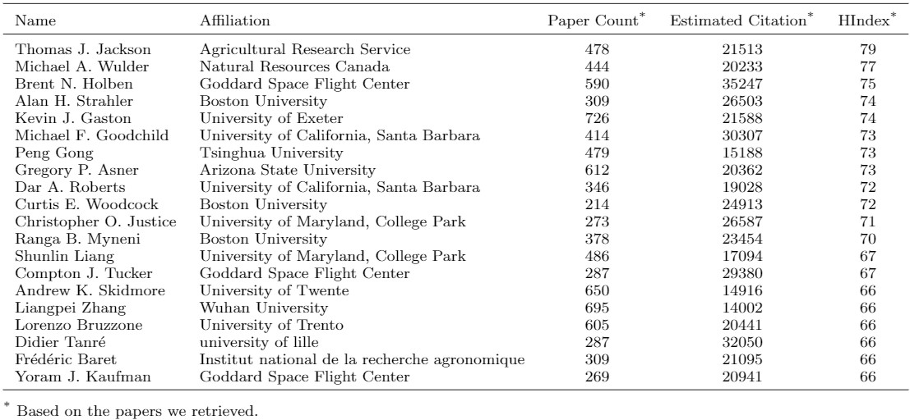

# GIST graph website
This is a website for visulizing our GIST graph. It povides multiple view/entry.

---
## Install
To be updated. We will release our data and code after acceptance of the paper.
Most of the front end can be directly access. But there is no backend service right now.
The data is updated on March-27-2020

---
## [TreeView](./treeView-revise/Tree-view.html)

This is the treeView of the adjusted form of areas, themes, topics and learning objectives

The original GISBOK can be seen as [here](treeView.html)
The original EBK can be seen as [here](EBKWithValueTreeView.html)

---
## [Search](./3d-graph/index.html)

cool 3d search for gis knowledge

---
## [GeospatialMap](./gisbok_static_search/map.html)

Extracted geospatial information in GIS scientific publications

---
## [WebsiteBackup](./gisbok_static_search/index.html)

A backup of [https://gistbok.ucgis.org/](https://gistbok.ucgis.org/)

## Word cloud

Word cloud of GIS papers

## H-index

The H-index calculation based on our retrieved publications. (To be updated)

---
## version history

- v0.1 This page is updated at July-13-2020
